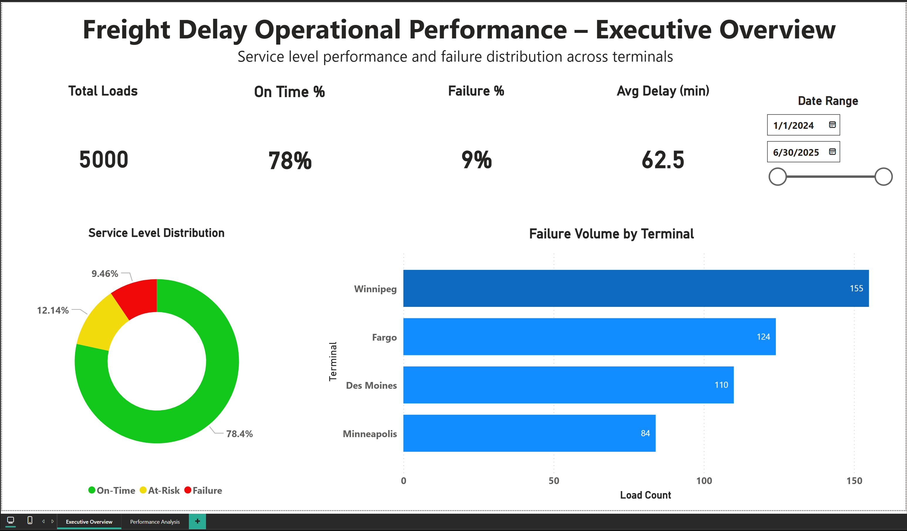
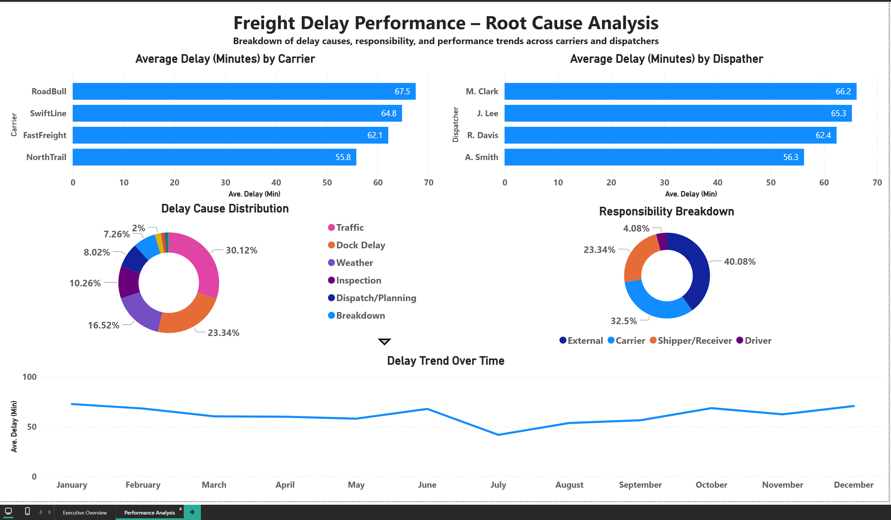

# Freight Delay Operational Analysis

## Project Overview

This project analyzes freight delay performance across carriers, dispatchers, and terminals to identify operational inefficiencies and root causes of service failures.

The goal is to move beyond simple reporting and provide insights into **why delays occur**, how they impact service levels, and where operational improvements can be made.

---

## Business Questions

This analysis focuses on answering:

1. What percentage of freight is delivered on time versus at risk or failed?
2. Which terminals, carriers, and dispatchers contribute most to delays?
3. What are the primary causes of delays, and who is responsible?

---

## Key Insight

Average delay is influenced by infrequent but severe disruptions (e.g., breakdowns, weather events such as winter storms, high winds, hurricanes, tornadoes, and inspections).

While the majority of loads are delivered on time, these high-impact events significantly increase the overall average delay.

---

## Dashboard Preview

### Executive Overview


### Root Cause Analysis


---

## Tools Used

* Power BI (data modeling and dashboard design)
* Python (data simulation and transformation)

---

## Repository Structure

```
freight-delay-operational-analysis/
│
├── dashboard/
│   └── Freight_Delay_Operational_Performance.pbix
│
├── data/
│   └── freight_delay_final.csv
│
├── images/
│   ├── Executive Overview.png
│   └── Performance Analysis.png
│
└── README.md
```

---

## How to Use

1. Open the `.pbix` file in Power BI Desktop
2. Use the date slicer to filter performance over time
3. Navigate between:

   * **Executive Overview** (high-level performance metrics)
   * **Root Cause Analysis** (detailed breakdown of delays)

---

## Notes

* The dataset is synthetically generated but designed to reflect real-world trucking operations.
* Delay distributions include both common operational friction (traffic, dock delays) and rare high-impact disruptions (weather events, breakdowns).
* The dashboard is designed with a focus on decision-making rather than exploratory analysis.

---

## Disclaimer

This dataset is simulated for portfolio purposes.  
It is designed to reflect realistic freight operations but does not represent any specific company.
